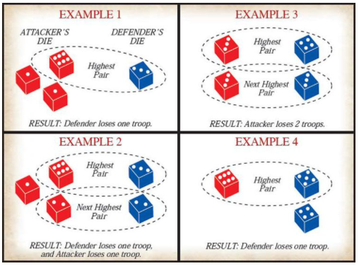

```{r}
# Import the code that contains the functions
source("Risk_util_functions.R")

library(knitr)
opts_chunk$set(dev="png")
```

### 1) Basics

In Risk, all players need to have at least one army to play. A player loses when he no longer has armies under his command. To win, a player needs to be the last one standing (the only one with an army).

How can someone lose her/his armies? **By receiving an attack!**

An attack must involve two players: an attacker and a defender. The attacker can roll 3 dice at most, and she/he needs to have at least one more army in her/his territory than the number of dice rolled. The defender can roll 1 or 2 dice: To roll 2 dice, he/she must have at least 2 armies on the territory under attack.

To decide the outcome of a battle, we compare the highest die each player rolled. The defender loses one army when the attacker's die is (strictly) higher than the one of the defenders. If each player rolled more than one die, the second highest die of each player is compared, and the process is repeated. In other words, if each player rolled more than one die, then each player can lose 2 armies. The following image explains this process clearly:

 

For more information about the game and its rules, please visit the following [link](https://www.ultraboardgames.com/risk/game-rules.php).

### 2) How many dice should you roll?

An attacker can choose to roll 1-3 dice and a defender can roll 1-2 dice. How many dice should each choose to roll?

This is a very important question, and it has a very straightforward answer: roll as many as you can. Using the functions found in Risk_util_functions.R, we can prove this fact.

##### a. Explaining *montecarlo_sim_turn*

```{r}
# The following code simulates a turn where the attacker uses 3 dice and the defender uses 1 die 10,000 times. 
montecarlo_sim_turn(3,2, reps = 10000, seed = 12345)

```
As we can see, under these circumstances, the expected loss of the attacker is 0.9314 and the expected loss of the defender is 1.06. Also, it shows that the attacker will lose 0 armies a little more often than one third of the time (0.3669) and will lose two armies a little less often than a third of the time (0.2983). Let's use this function to create a graph that can yield some interesting results.

##### b. How many armies is the attacker expected to lose under each scenario?

```{r}
# Simulate all scenarios
mcsim_prob <- matrix(NA, nrow=6, ncol=7)
i = 1
for (da in 1:3){
  for (dd in 1:2){
    mcsim_prob[i, ] = montecarlo_sim_turn(da, dd, reps = 10000, seed = 12345)
    i = i + 1
  }
}
```

```{r fig_1}

x <- as.vector(mcsim_prob[mcsim_prob[,7] == 1, c(6)])
y1 <- as.vector(mcsim_prob[mcsim_prob[,7] == 1, c(1)])
y2  <- as.vector(mcsim_prob[mcsim_prob[,7] == 2, c(1)])

plot(x, y2, type = "l", frame = FALSE, pch = 19, 
     col = "black", xlab = "# dice thrown by attacker", ylab = "Expected army loss",
     ylim = c(0.3, 1.2), lwd=4, xaxt = "n")
lines(x, y1, pch = 18, col = "dark grey", type = "l", lty = 2, lwd=4)
axis(1, at = c(1, 2, 3))
text(1.25, 0.95, "Defender threw 2 dice", srt = 27)
text(1.25, 0.6, "Defender threw 1 die", srt = -10)
title("Armies lost by the attacker", adj = 0, line = 1)
```

 

When the defender throws 1 die, we should throw as many dice as possible if we want to minimize our army loss. However, if the defender throws 2 dice, the story is a little more puzzling. It seems that our expected loss is minimized when we throw only one die. 

Why does this happen? Because when you throw one die, you can only lose one army at most, but you can also make your opponent lose only one army. When you increase the dice you throw, you are susceptible to losing one additional army, but so is your opponent. So maybe we should look at the differential of both losses: the expected loss of the defender minus the attacker. This way, we can have a measure of the net effect of our attack, which may prove more useful.
 
```{r fig_2}
x <- as.vector(mcsim_prob[mcsim_prob[,7] == 1, c(6)])
y1 <- as.vector(mcsim_prob[mcsim_prob[,7] == 1, c(2)]) - as.vector(mcsim_prob[mcsim_prob[,7] == 1, c(1)]) 
y2  <- as.vector(mcsim_prob[mcsim_prob[,7] == 2, c(2)]) - as.vector(mcsim_prob[mcsim_prob[,7] == 2, c(1)]) 

plot(x, y2, type = "l", frame = FALSE, pch = 19, 
     col = "black", xlab = "# dice thrown by attacker", ylab = "Exp(Defender losses - Attacker losses)",
     ylim = c(-0.6, 0.6), lwd=4, xaxt = "n")
lines(x, y1, pch = 18, col = "dark grey", type = "l", lty = 2, lwd=4)
axis(1, at = c(1, 2, 3))
text(1.25, -0.4, "Defender threw 2 dice", srt = 4)
text(1.25, 0, "Defender threw 1 die", srt = 15)
title("Net damage taken by defender", adj = 0, line = 1)
```

 

As we see in the graph, as the number of dice thrown by attacker increases, the net damage taken by the opponent (damage taken by the defender minus damage taken by attacker) increases too. This means that although throwing more dice increases the expected loss for the attacker, it also increases the expected loss for the defender with a bigger magnitude. Therefore, for the defender to take more damage than the attacker, the attacker needs to throw as many dice as possible. 

##### c. What's the likelihood of losing armies under each scenario?


```{r fig_3}
barplot(t(mcsim_prob[mcsim_prob[,7] == 1,c(3,4)]) , main="",
   xlab="# dice thrown by attacker", beside = TRUE, names.arg = c("1", "2", "3"),
   ylab = "Probability", legend.text = c("0", "1"),
   args.legend=list(title="Armies lost by attacker", bty = "n", border = "white", 
                    inset=c(-0.02,0), xpd=TRUE, x = 9.75, y= 0.75), 
   border = "white")

title("Defender throws 1 die", adj = 0, line = 1)
```

 

If the defender throws one die, the probability of losing one army decreases as the number of dice thrown by attacker increases.

```{r fig_4}
barplot(t(mcsim_prob[mcsim_prob[,7] == 2,c(3,4,5)]) , main="",
   xlab="# dice thrown by attacker", beside = TRUE, names.arg = c("1", "2", "3"),
   ylab = "Probability", legend.text = c("0", "1", "2"),
   args.legend=list(title="Armies lost by attacker", bty = "n", border = "white"), 
   border = "white")

title("Defender throws 2 dice", adj = 0, line = 1)

```

 

If the defender throws two dice, the probability of not losing any troops increases with the number of dice thrown. The probability of losing one army also decreases with the number of dice thrown. However, increasing the number of dices thrown by the attacker also increases the probability of losing 2 armies. This is consistent with what we found above, throwing more dice increases the risk of losing 2 troops instead of only one, but it also increases the likelihood that you'll generate more damage to your opponent.


### 3) What's the likelihood that you completely defeat your opponent in a given territory?

Let’s say that we want to attack our opponent's territory until she/he no longer has any troops in that territory. How likely are we to succeed? The function *success_until_defeat* is useful for this purpose. 

```{r}
success_until_defeat(7, 2, output = FALSE)
```

As it is shown above, the probability that this set of attacks succeeds is high: if repeated, we should win 94% of the time. Now, although this seems encouraging, we should be careful as it is still possible to fail. Particularly, what if we lose 2 troops in the first dice roll. How does our likelihood of success change? This is something we can explore with a graph. 

```{r}
y1 = c()
y2 = c()
x = 2:7

for (i in x){
  y1[i-1] = success_until_defeat(i, 2, verbose = FALSE)$prob_succ
  y2[i-1] = success_until_defeat(i, 1, verbose = FALSE)$prob_succ
}
```


```{r fig_5}
plot(x[x!=7], y2[x!=7], type = "b", frame = FALSE, pch = 19, 
     col = "black", xlab = "Armies owned by attacker", ylab = "Probability",
     xlim = rev(range(x)), lwd=4, ylim = c(0,1))
lines(x, y1, pch = 19, col = "dark grey", type = "b", lty = 2, lwd=4)

text(3.5, 0.9, "Defender has one army", srt = -20)
text(3.5, 0.61, "Defender has two armies", srt = -28)
title("Probability that an attack will result in defeat", adj = 0, line = 1)
```

 

As shown above, if we lose 2 troops in the first roll, we will have 5 troops left and the defender would still own 2. That would decrease our likelihood of success from 0.94 to 0.78. That is still high. But what if we lost two troops again? That would decrease our chances of success to 0.37. If this unlikely scenario happened, it would be better to stop attacking your opponent. Therefore looking at these probabilities dynamically is important.
